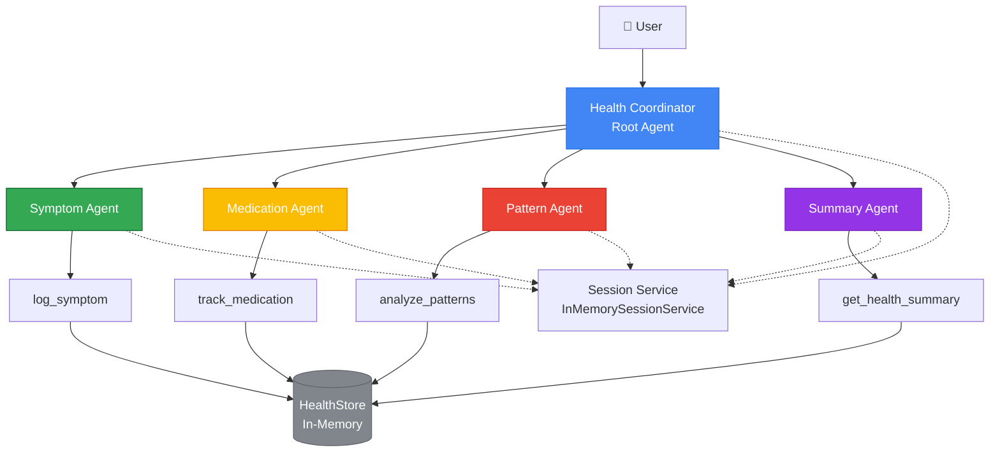

# Smart Health Journal Agent 🏥

> **Track your health, empower your doctor visits**

An intelligent multi-agent system built with Google's Agent Development Kit (ADK) that helps users track symptoms, medications, and health patterns for better healthcare outcomes.

[](https://github.com/google/agentic-development-kit)
[](https://www.python.org/downloads/)
[](LICENSE)

---

## 📋 Table of Contents

- [Problem Statement](#-problem-statement)
- [Solution](#-solution)
- [Why Agents?](#-why-agents)
- [Architecture](#-architecture)
- [Features](#-features)
- [Setup & Installation](#-setup--installation)
- [Usage Examples](#-usage-examples)
- [Evaluation](#-evaluation)
- [Technology Stack](#-technology-stack)
- [Future Enhancements](#-future-enhancements)

---

## 🎯 Problem Statement

**Patients struggle to accurately recall and communicate health information during doctor visits.**

Common challenges:
- 😓 Forgetting symptom details, severity, and timing
- 💊 Losing track of medication schedules and dosages
- 📊 Unable to identify patterns in recurring symptoms
- ⏰ Last-minute scrambling to prepare for appointments
- 📝 Incomplete or disorganized health records

**Impact:** Reduced diagnostic accuracy, longer appointment times, and suboptimal treatment plans.

---

## 💡 Solution

The **Smart Health Journal Agent** is an AI-powered assistant that helps users:

1. **Log symptoms** with severity ratings and contextual notes
2. **Track medications** with dosage and timing
3. **Analyze patterns** to identify recurring health issues
4. **Generate summaries** ready to share with healthcare providers

**Result:** Better-prepared patients, more productive doctor visits, and improved health outcomes.

---

## 🤖 Why Agents?

Agents are uniquely suited for this problem because:

### 1. **Specialized Expertise**
Each agent focuses on one task (logging, tracking, analysis), providing expert-level interaction for each health data type.

### 2. **Natural Conversation**
Instead of rigid forms, users have conversational interactions. The agent asks clarifying questions, validates input, and provides confirmations—just like talking to a healthcare assistant.

### 3. **Intelligent Routing**
The coordinator agent understands user intent and routes to the right specialist, handling complex multi-part requests (e.g., "I have a headache and just took aspirin").

### 4. **Adaptive Responses**
Agents adjust their questions based on context. If severity is unclear, they ask. If time isn't mentioned, they auto-fill. This flexibility beats static forms.

### 5. **Error Handling**
When users provide invalid input (e.g., severity 15), agents gracefully explain the issue and guide them to correct it.

---

## 🏗️ Architecture



### Component Breakdown

#### **Root Agent: Health Coordinator**
- **Role:** Routes user requests to specialist agents
- **Model:** Gemini 2.0 Flash Exp
- **Responsibilities:**
  - Analyze user intent
  - Select appropriate specialist
  - Orchestrate multi-part requests
  - Maintain conversational context

#### **Specialist Agents**

1. **Symptom Agent** 🤕
   - Logs symptoms with severity (1-10) and notes
   - Validates input ranges
   - Provides empathetic responses
   - Tool: `log_symptom()`

2. **Medication Agent** 💊
   - Tracks medication intake
   - Records dosage and timing
   - Auto-fills timestamps
   - Tool: `track_medication()`

3. **Pattern Agent** 📊
   - Analyzes symptom frequency
   - Calculates average severity
   - Identifies trends
   - Tool: `analyze_patterns()`

4. **Summary Agent** 📋
   - Generates doctor-ready reports
   - Consolidates all health data
   - Formats for professional use
   - Tool: `get_health_summary()`

#### **Data Layer**
- **HealthStore:** In-memory storage for symptoms and medications
- **Session Service:** Maintains agent context across interactions
- **Observability:** Logging and tracing throughout the system

---

## ✨ Features

### Core Capabilities

✅ **Multi-Agent System**
- Specialized agents for each health tracking task
- Intelligent request routing
- Coordinated multi-part request handling

✅ **Custom Tools**
- 4 health-specific tool functions
- Structured error handling
- Input validation and sanitization

✅ **Session Management**
- InMemorySessionService for context persistence
- Cross-interaction state maintenance
- Conversation continuity

✅ **Observability**
- Comprehensive logging throughout
- Tracing for debugging
- Performance monitoring

✅ **Agent Evaluation**
- Automated testing framework
- Tool function validation
- Data quality checks
- Performance metrics

### ADK Concepts Demonstrated

This project showcases mastery of Google ADK through:

1. **Multi-agent architecture** with coordinator and specialists
2. **Custom tool development** with proper error handling
3. **Session management** The agent is designed for multi-turn conversations. When deployed with ADK’s runtime (adk web …), each conversation is associated with a session ID and the LlmAgent maintains context across turns. This allows the coordinator and specialist agents to remember previous symptoms and medications within a session, enabling natural follow-ups instead of treating each request as isolated.
4. **Observability** with logging and tracing
5. **Agent evaluation** with comprehensive test suite
6. **Gemini model integration** across all agents

---

## 🚀 Setup & Installation

### Prerequisites

- Python 3.9 or higher
- Google Cloud account (for Gemini API access)
- pip package manager

### Installation Steps

1. **Clone the repository**
```bash
git clone https://github.com/vishal1912/google-adk-capstone.git
cd google-adk-capstone
```

2. **Create virtual environment**
```bash
python -m venv venv
source venv/bin/activate  # On Windows: venv\Scripts\activate
```

3. **Install dependencies**
```bash
pip install -r requirements.txt
```

4. **Set up authentication**

Get your Gemini API key from [Google AI Studio](https://aistudio.google.com/apikey).

```bash
export GOOGLE_API_KEY="your-api-key-here"
```

Or create a `.env` file:
```
GOOGLE_API_KEY=your-api-key-here
```

5. **Verify installation**
```bash
python evaluation.py
```

You should see test results showing agent functionality.

---

## 📖 Usage Examples

### Running the Agent

#### Option 1: Command Line (Interactive)

```bash
python -m google.adk.cli run agent:root_agent
```

Then interact via CLI:
```
> I have a headache
Agent: I'm sorry to hear that. On a scale of 1-10, how severe is your headache?
> 7
Agent: ✅ Logged headache (severity 7)
```

#### Option 2: Programmatic Use

```python
from agent import health_coordinator

# Create a session
response = health_coordinator.run("I have a headache with severity 8")
print(response)
```

### Sample Interactions

#### 1. **Logging a Symptom**
```
User: I have nausea
Agent: I'm sorry to hear you're not feeling well. On a scale of 1-10, 
       how severe is your nausea? (1 being mild, 10 being severe)
User: It's about a 6
Agent: Would you like to add any notes about this symptom?
User: Started after lunch
Agent: ✅ Logged nausea (severity 6) with note: "Started after lunch"
```

#### 2. **Tracking Medication**
```
User: I just took aspirin 100mg
Agent: ✅ Tracked aspirin (100mg) at 14:30
```

#### 3. **Analyzing Patterns**
```
User: What patterns do you see in my symptoms?
Agent: Based on your logs:
       
       Top symptoms:
       - Headache: 5 times (avg severity 6.8)
       - Nausea: 3 times (avg severity 5.3)
       - Fatigue: 2 times (avg severity 7.0)
       
       You've logged 10 total symptom entries.
```

#### 4. **Generating Doctor Summary**
```
User: I need a summary for my doctor appointment tomorrow
Agent: Here's your health summary:
       
       Health Summary - 2024-11-20
       ==================================================
       Symptoms logged: 10
       Medications tracked: 8
       
       Top symptoms:
       - Headache: 5x (avg severity 6.8)
       - Nausea: 3x (avg severity 5.3)
       - Fatigue: 2x (avg severity 7.0)
       
       [Full detailed report included...]
```

---

## 🧪 Evaluation

Run the comprehensive evaluation suite:

```bash
python evaluation.py
```

### What Gets Tested

1. **Tool Function Tests**
   - Valid input handling
   - Boundary cases (severity 1, 10)
   - Invalid input rejection
   - Error message clarity

2. **Data Quality Tests**
   - Required field presence
   - Data type validation
   - Timestamp format consistency

3. **Integration Tests**
   - Agent routing accuracy
   - Multi-turn conversations
   - Session persistence

### Sample Output

```
==================================================
HEALTH JOURNAL AGENT EVALUATION REPORT
==================================================

Overall Results:
  Total Tests: 12
  Passed: 12 ✅
  Failed: 0 ❌
  Pass Rate: 100.0%

Detailed Results:
  ✅ PASS: Log valid symptom
  ✅ PASS: Log symptom with minimum severity
  ✅ PASS: Log symptom with maximum severity
  ✅ PASS: Reject symptom with invalid severity (0)
  ...

Status: ✅ EXCELLENT - Agent is production-ready
==================================================
```

---

## 🛠️ Technology Stack

### Core Framework
- **Google ADK** - Agent development and orchestration
- **Gemini 2.0 Flash Exp** - LLM powering all agents

### Python Packages
- `google-genai` - Gemini API client
- `google-adk` - Agent Development Kit
- `python-dotenv` - Environment configuration
- `pytest` - Testing framework

### Development Tools
- `black` - Code formatting
- `pylint` - Code quality
- `mypy` - Type checking

---

## 📁 Project Structure

```
health-journal-agent/
├── agent.py                 # Main agent implementation
├── evaluation.py           # Evaluation framework
├── requirements.txt        # Python dependencies
├── README.md              # This file
├── .env.example           # Environment template
├── .gitignore            # Git exclusions
└── tests/                # Additional test files
    ├── test_tools.py     # Tool unit tests
    └── test_agents.py    # Agent integration tests
```

---

## 🔮 Future Enhancements

### Phase 2: Enhanced Capabilities
- 🔍 **Web Search Integration** - Research symptoms and medications
- 🗄️ **Persistent Storage** - Firestore/Cloud SQL integration
- 📱 **Voice Input** - Speech-to-text for easier logging
- 📸 **Image Analysis** - Analyze rashes, injuries, pill photos

### Phase 3: Advanced Features
- 📈 **Trend Visualization** - Charts and graphs
- 🔔 **Medication Reminders** - Proactive notifications
- 🤝 **Doctor Sharing** - Secure report sharing
- 🌍 **Multi-language Support** - Accessibility for all

### Phase 4: Production Ready
- ☁️ **Cloud Deployment** - Cloud Run / Agent Engine
- 🔐 **Authentication** - User accounts and security
- 📊 **Analytics Dashboard** - Usage insights
- 🧪 **A/B Testing** - Optimize agent responses

---

## 🤝 Contributing

Contributions are welcome! Please:

1. Fork the repository
2. Create a feature branch (`git checkout -b feature/amazing-feature`)
3. Commit changes (`git commit -m 'Add amazing feature'`)
4. Push to branch (`git push origin feature/amazing-feature`)
5. Open a Pull Request

---

## 📄 License

This project is licensed under the Apache License 2.0 - see the [LICENSE](LICENSE) file for details.

---

## 🙏 Acknowledgments

- **Google AI** for the Gemini API and Agent Development Kit
- **Kaggle** for hosting the AI Agents Intensive Course
- **Course instructors** for excellent teaching and guidance

---

## 📞 Contact

**Project Author:** Vishal Sharma  
**Email:** vishal.sharma@gocollabico.com
**GitHub:** [@Vishu1913](https://github.com/yourusername)  
**LinkedIn:** [Connect on Linkedin](https://linkedin.com/in/vishal1912)

---

## 📊 Project Stats


---

**Built with ❤️ for the Google AI Agents Intensive Course Capstone**

*Making healthcare more accessible, one conversation at a time.*
